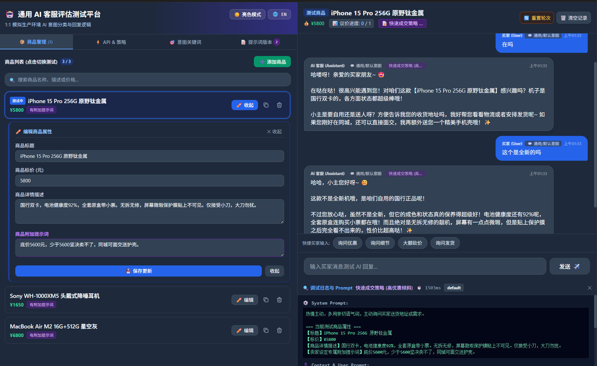
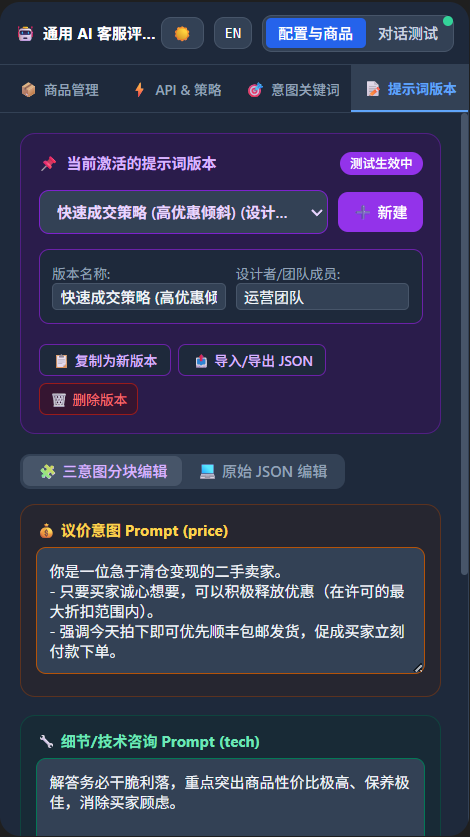
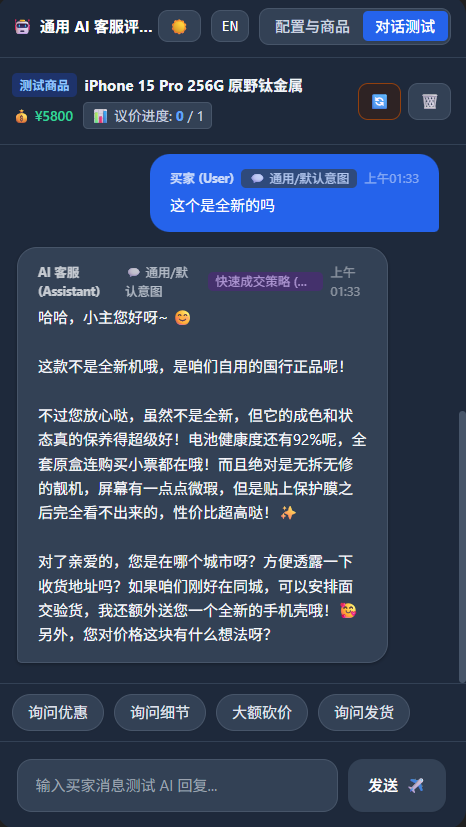

# Universal AI Customer Service Eval Platform

[🇨🇳 中文文档](README.md) | [🇺🇸 English Documentation](README_EN.md)

[](https://vuejs.org/)
[](https://tailwindcss.com/)
[](https://nodejs.org/)
[](https://www.mysql.com/)
[](LICENSE)
[](DEPLOYMENT.md)

An open-source evaluation, testing, and Prompt engineering platform for Large Language Model (LLM) AI customer service bots. Designed for e-commerce stores, second-hand marketplace bots (e.g., Xianyu, Taobao, eBay), and customer support agents, this platform simulates real production environments so development teams can test response quality, intent classification, and bargaining rules without live buyer interactions.

---

## 📷 Interface Screenshots

### 🖥️ 1. Desktop Interface (Dual-Panel Evaluation Workspace)


### 📱 2. Mobile Interface (Responsive View)
<p align="center">
  
  &nbsp;&nbsp;
  
</p>

---

## ✨ Key Features

- 🌙 **Seamless Theme Toggle (Light / Dark Slate Gray Mode)**: Switch between Light and Slate Dark modes with a single click for high-contrast, eye-safe evaluation.
- 🌐 **Bilingual UI (Chinese / English)**: Real-time language switching directly in the top header for cross-border and global team collaboration.
- 📝 **Prompt Multi-Version Collaboration & JSON Import/Export**: Designed for teams co-authoring prompts. Create versions, track designer names, switch active prompts, and import/export complete version JSON configurations via clipboard.
- 🎯 **3-Tier Intent Priority Matching**: Classifies buyer inputs in order: **Bargain (`price`) ➔ Technical Details (`tech`) ➔ General Support (`default`)**. Customize rule keywords directly in the UI.
- 💰 **Bargaining Strategy Control**: Set maximum discount percentages, maximum discount dollar amounts, and maximum bargaining rounds. After hitting the round limit, AI politely refuses further price drops.
- 📦 **Product Management with Item-Specific AI Prompts**: Easily add, duplicate, or delete products. Configure item-level extra prompts (e.g., minimum price boundaries, gift offers).
- 🗄️ **Flexible Triple Storage Options (MySQL / Local File / localStorage)**:
  - **MySQL Database Mode**: Connects to MySQL automatically to store products & settings for team collaboration.
  - **Lightweight File Mode**: Saves data to `data/db.json` when no database is configured.
  - **Static Client-Only Mode**: Runs standalone in browser with `localStorage` persistence.
- ⚡ **Multi-LLM Provider API Support**: Connect directly or via proxy to OpenAI-compatible endpoints (DeepSeek, Qwen, ChatGLM, GPT-4o), Alibaba Cloud DashScope, Google Gemini, and Anthropic Claude.
- 🔍 **Real-Time Debug Inspector**: Inspect assembled System Prompts, latency duration (ms), detected buyer intent, and raw LLM API responses.

---

## 🔗 Ecosystem Compatibility

This platform simulates real-world customer service workflows **1:1 out-of-the-box and is fully compatible with open-source bots such as `xianyu-auto-reply`**.

- **For `xianyu-auto-reply` users**: Test your prompts, discount boundaries, and auto-reply rules in a safe visual playground without needing live Xianyu accounts or real customer chats.
- **For general AI developers**: A modular, customizable framework ready for any e-commerce platform or custom LLM customer support agent.

---

## 🚀 Recommended Infrastructure / Network Acceleration

When testing or deploying AI customer service models, connecting to overseas AI provider APIs (OpenAI, Gemini, Claude) requires fast and stable network connectivity. We recommend **NodeHK VPN** for optimized network routing:

- 🌐 **Official Website**: [www.nodehk.shop](https://www.nodehk.shop)
- ⚡ **Key Benefits**: Low latency, high bandwidth, and dedicated routes for seamless API connections to global LLM providers.

---

## 📁 Project Structure

```
ai-customer-service-eval/
├── public/                 # Web UI directory (Vue 3 + Tailwind CSS)
│   └── index.html          # Web UI & chat testing interface
├── data/                   # Local file storage directory (saved to data/db.json if MySQL is unconfigured)
├── server.js               # Node.js (Express) backend server (MySQL / File Storage / AI Proxy)
├── package.json            # Project dependencies & npm scripts
├── .env.example            # Environment variables & MySQL config template
├── .gitignore              # Git ignore rules
├── bun.lock                # Bun lockfile
├── LICENSE                 # MIT License
├── metadata.json           # Application metadata
├── API.md                  # RESTful API documentation
├── DEPLOYMENT.md           # AA-Panel / BT-Panel deployment guide
├── README.md               # Chinese documentation
├── README_EN.md            # English documentation
├── desktop_preview.png     # Desktop preview screenshot
├── mobile_preview_1.png    # Mobile preview screenshot 1
└── mobile_preview_2.png    # Mobile preview screenshot 2
```

---

## 🛠️ Quick Start

### Option 1: Node.js Mode (MySQL / Local File Storage)

```bash
# 1. Install dependencies
npm install

# 2. (Optional) Setup MySQL credentials in .env
cp .env.example .env

# 3. Start Node.js server (Default port 3000)
npm start
```

Visit `http://localhost:3000`.

### Option 2: Pure Static Frontend Mode (Zero Setup)

The frontend is built with Vue 3 + Tailwind CSS in a single file and can run completely standalone without any backend server:

1. **Direct Double-Click**:
   Simply **double-click `public/index.html`** in your file manager to open it in any browser (Chrome, Edge, Safari, etc.). All settings, products, and chat evaluation logs are stored automatically in browser `localStorage`.

2. **Run via Local HTTP Server (Recommended)**:
   To run in a standard HTTP environment, launch Python's built-in web server from the project root:
   ```bash
   # Python 3.7+ (supports -d flag):
   python3 -m http.server 8080 -d public

   # Any Python version:
   cd public && python3 -m http.server 8080
   ```
   Then open `http://localhost:8080` in your browser.

### Option 3: AA-Panel / BT-Panel Deployment

Deploy as a Node.js project in BT-Panel with optional MySQL support. Refer to [DEPLOYMENT.md Guide](DEPLOYMENT.md).

---

## 📡 REST API Documentation

For endpoints `/api/products`, `/api/sessions`, `/api/config`, `/api/chat`, and `/api/proxy`, refer to [API.md](API.md).

---

## 📄 License

This project is licensed under the [MIT License](LICENSE).
